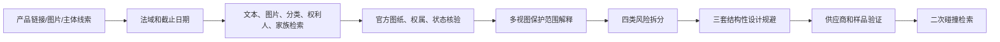

# Design Patent Search And Design Around Skill

面向实体产品团队的外观专利预筛与设计规避 Skill。

它不只告诉你“有哪些相似专利”，而是把产品图片、完整专利图纸、权利人线索、供应链证据、设计方案和样品验证连接成一条可复核的决策链：

> 找到可能相关的设计权 → 解释图纸保护了什么 → 拆分不同类型的风险 → 生成结构关系明显不同的改款方向 → 交给供应商打样 → 对新方案再搜一次。

本项目适用于产品经理、工业设计师、研发工程师、供应链团队、跨境电商卖家和准备正式律师审查的项目负责人。

## 解决什么问题

实体产品的外观风险通常卡在四个断点：

1. 只按产品名称搜，找不到真正的权利人或相关设计家族；
2. 看到一个专利号，却没有读完整图纸、线型和多视图关系；
3. 把法院层面的实质侵权、平台投诉、权属不清和未公开申请混成一个分数；
4. 让设计师“改一个特征”，却没有形成能打样、能量产、能二次检索的方案。

这个 Skill 把上述问题变成产品开发可以执行的工作流。它支持汽车配件、家居用品、工具、消费电子、家具、包装结构和其他以视觉外观为重要竞争要素的实体产品。

## 和普通方案的差异

| 方案 | 擅长什么 | 常见断点 | 本 Skill 的补足 |
| --- | --- | --- | --- |
| 专利搜索 API / 数据库 | 快速返回文本和元数据 | 只给列表，不解释整体视觉印象和下一步产品决策 | 完整图纸、视图级比较、证据置信度和设计决策 |
| 电商 IP 风险工具 | 监测投诉、TRO、权利人信号 | 偏平台暴露，通常不负责产品重构 | 把平台投诉风险和实质风险分开，并输出改款方向 |
| 通用产品调研 | 需求、价格、竞品和评论 | 不处理外观设计权保护范围 | 把产品调研接到外观预筛、供应商尽调和样品验证 |
| 正式律师 / FTO | 最高价值的法律解释和特权保护 | 成本更高，通常在产品假设已经形成后介入 | 先产出结构化预筛和律师可复核证据包；不替代律师 |
| 纯图片相似度搜索 | 发现相似图像 | 相似度本身不是法律结论，也不是设计方案 | 把图片搜索作为一条路线，再回到官方记录和完整视图验证 |

## 核心优势

- **权利人网络搜索**：沿 seller、brand、supplier、factory、designer、inventor、assignee、affiliate 和 patent family 扩展，不停在商品页上的品牌名。
- **图纸级范围解释**：读取完整视图、实线/虚线、边界线和说明书关系，把“专利保护什么”说清楚。
- **风险拆分**：分别给出实质侵权、平台投诉、权属不确定性、未公开申请和运营回退风险。
- **可执行的设计规避**：同时改变主结构、轮廓、部件关系、比例、端部和开口节奏，而不是只改颜色、logo 或一个截面。
- **供应链交接**：把“哪些特征不能在成本下降时恢复”转成供应商问题、工程门槛和样品验收点。
- **闭环复检**：优选方案必须再检索，避免为了避开一个候选专利而撞上另一个设计家族。

## 工作流



## 安装

将此目录复制到 Codex 的用户 Skill 目录：

```powershell
Copy-Item -Recurse .design-patent-design-around-public "$env:USERPROFILE\.codex\skills\design-patent-search-and-design-around"
```

如果目标目录已经存在，请先备份，再合并本目录中的 `SKILL.md`、`agents/openai.yaml` 和 `references/`。本发布包不会自动覆盖你现有的安装版本。

安装后可显式调用：

```text
$design-patent-search-and-design-around
```

## 三个使用教程

### 1. 产品链接预筛

适合只有 marketplace URL、SKU 和几张产品图的场景。提供目标国家、截止日期和上市时间，要求输出搜索日志、候选设计权、完整图纸范围、视图级对比、四类风险和三套规避方向。

示例：

```text
请对这个家居收纳产品做美国外观专利预筛。输入是产品链接、主图、侧视图和供应商型号。请输出搜索日志、候选专利、完整图纸保护范围、视图级对比、四类风险、三套可打样的规避方向，并标出仍需律师确认的事项。
```

### 2. 供应商尽调

适合供应商声称“原创”，但商品页上的卖家不是实际工厂的场景。提供品牌、贸易公司、工厂、设计师和任何投诉材料，让 Skill 沿实体和专利家族扩展搜索，并生成供应商证据清单。

示例：

```text
供应商声称产品原创，但卖家不是工厂。请沿品牌、贸易公司、实际工厂、设计师和权利人线索做外观设计权尽调，输出需要供应商补齐的证据清单，并把权属不确定性和平台投诉风险分开。
```

### 3. 设计规避到打样

适合产品功能必须保留，但外观结构接近候选设计权的场景。先声明不能改变的安装孔位、承重、材料、工艺和成本，再要求三套结构性方向、优选多视图、不得恢复清单和二次检索。

示例：

```text
我们要保留承重和安装孔位，但不能继续使用连续圆管、等距悬挂模块和中心桥。请生成三套外观结构差异明显、能交给供应商打样的设计规避方案，并列出成本下降时不得恢复的特征。
```

## 合成案例介绍

公开包使用完全合成的“模块化墙面收纳轨”案例，不对应真实品牌、供应商或专利。案例输入是一条连续圆形长轨、两个等距悬挂篮、中心装饰桥和重复横向开口；团队要保留承重、安装孔位和低成本，同时降低外观接近风险。

输出的三套方向是：

1. 折弯板式主脊 + 一体化凹入收纳区；
2. 三块分段式墙面板 + 错位容器；
3. 悬臂式薄板层架 + 隐藏后支撑。

优选方向不只更换涂层或圆管截面，而是同时改变主轮廓、部件关系、开口节奏和端部处理，再做承重、包装、供应商工艺和二次检索验证。完整案例见 [`references/example-generic-product.md`](references/example-generic-product.md)。

## 输出示例

一次完整运行通常包含：

- 一页执行结论和搜索截止日期；
- 目标产品与证据登记表；
- 搜索词、数据库、图像路线、分类和权利人线索日志；
- 候选专利/注册设计登记表；
- 基于完整图纸的保护范围说明；
- perspective / top / side / front-rear / end 的视图级对比；
- 实质侵权、平台投诉、权属和未公开申请风险；
- 三套设计规避方向和优选多视图概念；
- 供应商证据问题、样品验证门槛和二次检索计划；
- 律师正式 FTO 或意见审查的交接清单。

## 重要边界

本 Skill 是设计权风险的公开记录预筛和设计开发工作流，不是律师意见、正式 FTO、诉讼策略或不侵权保证。外观设计权与实用专利权利要求是不同问题。未公开申请、数据库延迟、权利转让、许可关系和供应商身份不完整都会留下残余风险。生成图片是概念指导，不是工程图或制造图。

不要把真实客户、供应商、未公开申请、平台账号、投诉材料或凭据放进公开仓库。发布前应使用合成案例、脱敏证据和公开来源。

## 仓库结构

```text
design-patent-design-around-skill/
├── SKILL.md
├── agents/openai.yaml
├── references/
│   ├── workflow.md
│   ├── intake-and-deliverables.md
│   ├── competitive-positioning.md
│   ├── tutorial.md
│   └── example-generic-product.md
├── tests/trigger-cases.md
├── LICENSE
└── README.md
```

## 验证

在发布前运行：

```powershell
python C:\Users\SYZ\.codex\skills\.system\skill-creator\scripts\quick_validate.py .
```

同时按 [`tests/trigger-cases.md`](tests/trigger-cases.md) 做 3 个应触发和 2 个不应触发的人工路由检查，并确认所有参考链接可以打开。

## 发布与来源证明

仓库可以通过 Git 历史、受保护 tag、GitHub Release 和独立公布的 Ed25519 公钥指纹建立来源证据。来源证明应放在 `.well-known/skill-provenance.json`、发布清单和签名文件中，不应写入隐藏指令、零宽字符、追踪回调或影响 Skill 行为的“后门”。详见本地的 `skill-release-provenance` 工具说明。

## License

当前公开包附带 `LICENSE`，默认是保留所有权利的 source-available 发布。若你希望允许社区修改和再发布，请在首次公开前替换成明确的开源许可证，并同步更新 README。
