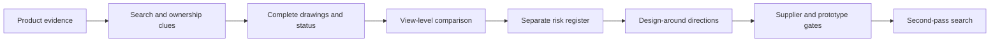

# Competitive Positioning

## What problem this skill solves

Most teams can find a patent number or a similar product. The harder decision is whether the product's overall visual arrangement is close enough to create practical risk, what the drawings actually show, and how to redesign without losing function, manufacturability, or launch timing.

This skill connects those decisions into one evidence trail:

## Positioning against common alternatives

| Alternative | What it does well | Typical gap | This skill's difference |
| --- | --- | --- | --- |
| Patent search API or database | Fast text and metadata retrieval | May return a list without explaining visual scope or product decisions | Adds drawing-set reading, view comparison, evidence confidence, and next actions |
| Marketplace IP-risk tool | Flags listing, complaint, or rights-holder signals | Often focuses on platform exposure and may not guide redesign | Separates platform complaint risk from substantive risk and creates design-around directions |
| Generic product-research workflow | Finds demand, competitors, price, and reviews | Does not establish design-rights scope or supplier-chain ownership | Connects product research to clearance pre-screening, sourcing, and prototype gates |
| Formal patent counsel / FTO | Highest-value legal interpretation and privilege | Slower, costlier, and usually starts after product hypotheses exist | Produces a structured pre-screen and attorney-ready evidence package; it does not replace counsel |
| Image similarity search | Finds visually related images | Similarity alone is not a legal or product decision | Uses image search as one route, then validates official records and full views |

## Defensible advantages

1. **Ownership-network search**: follows seller, brand, supplier, factory, designer, inventor, assignee, affiliate, and family clues rather than stopping at the listing name.
2. **Drawing-based explanation**: reads complete views, solid/broken-line conventions, and overall visual relationships instead of treating a patent as a feature checklist.
3. **Four risk lenses**: separates substantive infringement, marketplace complaint, ownership uncertainty, and unpublished-application risk.
4. **Executable design-around**: changes multiple high-salience relationships and maps them to function, process, tooling, supplier capability, and cost-down controls.
5. **Closed loop**: re-searches the preferred redesign so the team does not trade one collision for another.
6. **Product-manager handoff**: turns research into a decision artifact that engineering, sourcing, and counsel can use.

## Boundary of the claim

Do not describe this package as “formal FTO,” “legal clearance,” or “guaranteed non-infringement.” The honest positioning is: **an evidence-backed design-rights pre-screen and design-around planning workflow for physical products**.
